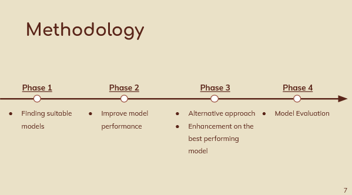
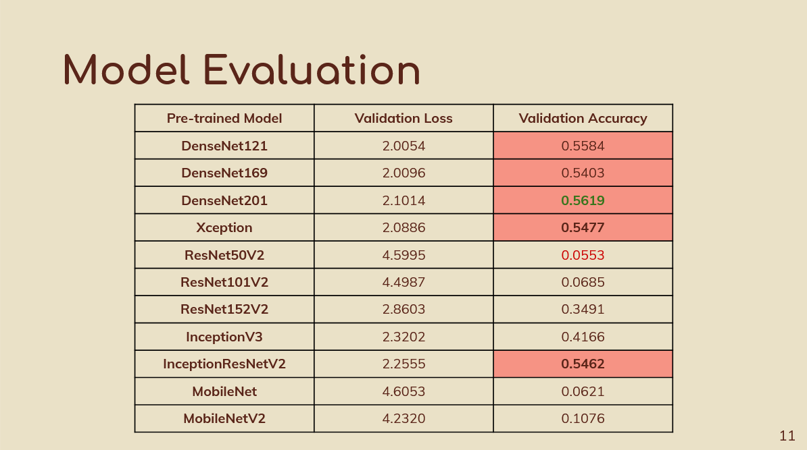
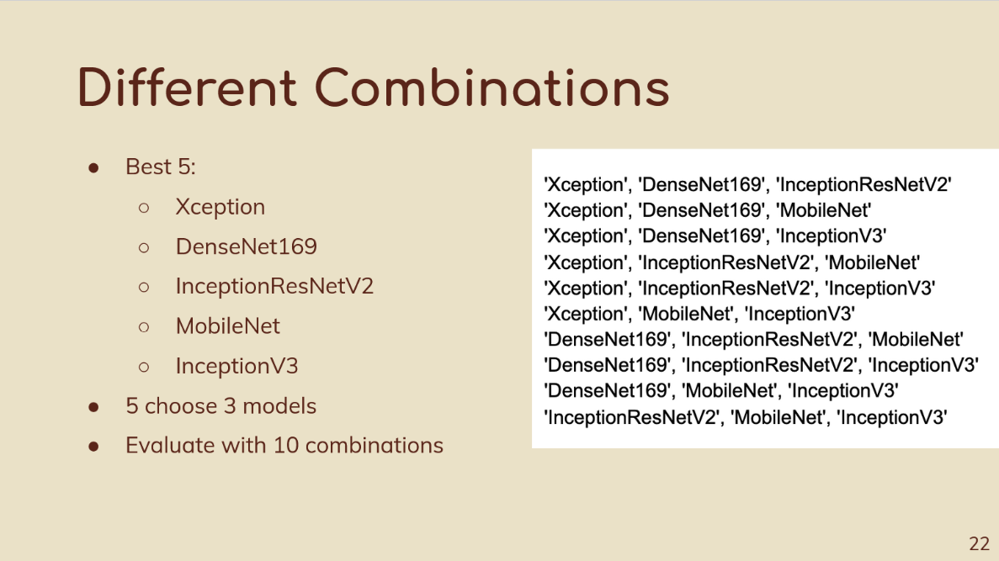
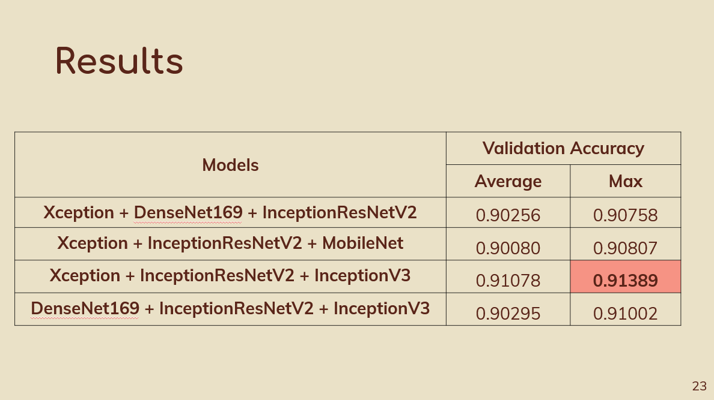
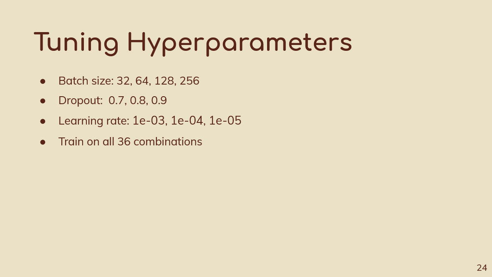
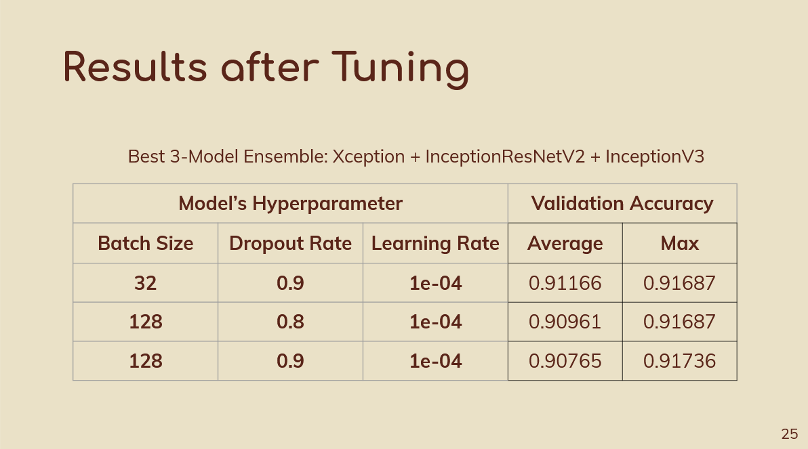
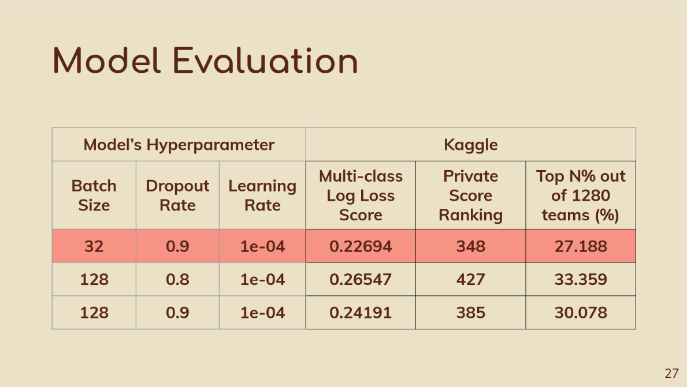
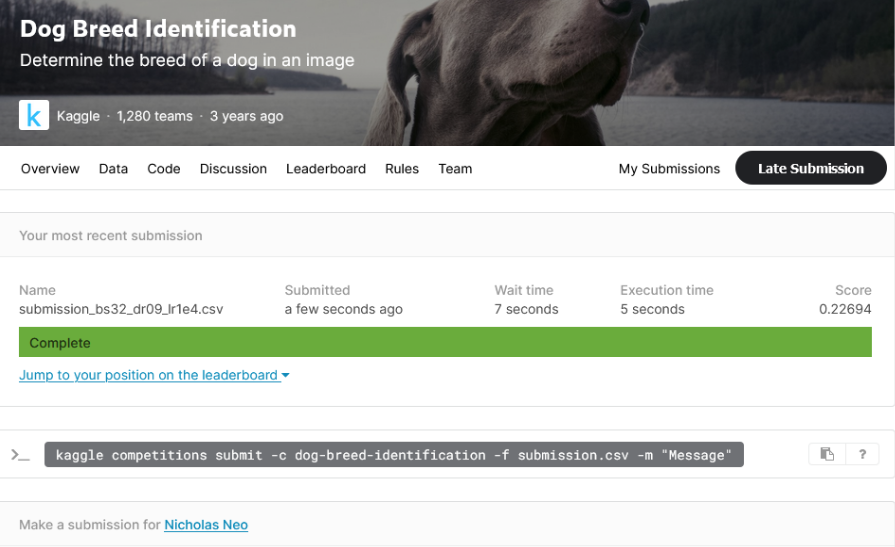

# CE/CZ4041 - Machine Learning Project
*A kaggle project done for the module CE/CZ4041 Machine Learning in Nanyang Technological University AY2020-21 Semester 2*    

### Kaggle: Dog Breed Identification
The Kaggle Project Link: [Kaggle Dog Breed Identification](https://www.kaggle.com/c/dog-breed-identification)  
  
Kaggle Dog Breed Identification Webpage:  
  
  
### Project Overview
- Introduction  
- Phase 1: Finding Suitable Models  
- Phase 2: Improve Model performance  
- Phase 3: Alternative Approach and Enhancement on the Best Performing Model  
- Phase 4: Model Evaluation  

### Presentation Video
[CE/CZ4041 Machine Learning Video Presentation](https://youtu.be/Yy3Qe17LaHw)   
   
   
### Introduction
**Problem Statemnt**  
There are about 7000 stray dogs in Singapore. Stray dogs in general are a threat as they may bite humans or spread diseases such as rabies. 
The main cause of stray dogs' problem is likely to be the dog owners abandoning their dog due to unfamiliarity with the dog’s characteristics. 
To prevent such issues, we aimed to devise a dog breed identification app to guide users about a particular dog’s characteristics for the soon-to-be dog owners. 
As such, when they encounter a dog of their liking, they can use our app to snap a photo of the dog to find out its breed and its characteristics. 
Hence, this provides soon-to-be dog owners with more information to assist them in making the right decision to pet that particular dog, 
thereby reducing the cases of abandoned dogs in the future. However, our app requires a dog breed classifier first before we could even deliver the app. 
As such, the objective for this project is to build a classifier to identify the dog breeds given the dog images.   
  
**Dog Breed Dataset**  
- Kaggle Project  
- Dog breed dataset from Kaggle  
	- 120 dog breeds  
	- 10,222 labelled trained images  
	- 10,357 unlabelled test images  
	- labels.csv  
  
**Aim of the Project**  
The aim of this project is to determine the dog breeds from the dog images with at least 90% accuracy on the validation set of the data.  
  
**Methodology**  
   
  
### Phase 1: Finding Suitable Models  
- Image Preprocessing  
- Model Structure  
- Model Evaluation  
  
**Model Evaluation Result**  
  

### Phase 2: Improve Model performance  
- Tune Hyperparameters  
- Increase Image Size  
- Problems Faced  
- Cause & Solution  
- Datatype to uint8  

### Phase 3: Alternative Approach and Enhancement on the Best Performing Model 
- Model Structure  
- Approach   
- Different Combinations  
- Results  
- Tuning Hyperparameters  
- Results after Tuning  

**Different Combinations**  
   
  
**Results**  
 
    
**Tuning Hyperparameters**    
 
    
**Results after Tuning**   
  
   
### Phase 4: Model Evaluation  
We evaluate the best three tuned models on the test set to get the multi-class log loss score   
   
  
### Kaggle Result
**Batch size 32 + dropout rate 0.9 + learning rate 0.0001**    
   
**Batch size 128 + dropout rate 0.8 + learning rate 0.0001**    
  
**Batch size 128 + dropout rate 0.9 + learning rate 0.0001**    
  
  
**A detailed report can be found in Report.pdf in the same repository**  